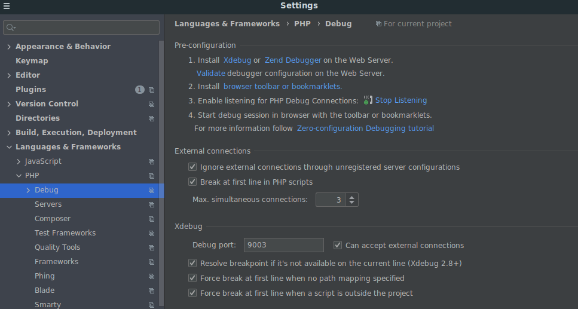
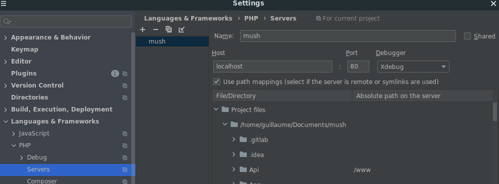

# Architecture

## Directory Tree:
    |-- bin/
    |-- config/
    |-- migrations/
    |-- public/
    |-- src/
        |-- Action/
        |-- Alert/
        |-- Communication/
        |-- Daedalus/
            |-- config
            |-- Controller
            |-- ConfigData
            |-- DataFixtures
            |-- Entity
            |-- Enum
            |-- Factory
            |-- Event
            |-- Listener
            |-- Normalizer
            |-- Repository
            |-- Service
            |-- Validator
        |-- Disease/
        |-- Equipment/
        |-- Exploration/
        |-- Game/
        |-- Hunter/
        |-- MetaGame/
        |-- Modifier/
        |-- Place/
        |-- Player/
        |-- Project/
        |-- RoomLog/
        |-- Status/
        |-- User/

    |-- tests/              --> Test directory
    |-- .env                --> environment variables
    |-- composer.json        --> dependencies

## Repositories

### bin/
Symfony/php commands, you can run for instance
```
bin/console
```
### config/
core config files, you will find every dependencies configuration, the routes definition, database configuration, etc...

We use ApiPlatform to generate a lot of routes, and the configuration for these can be found in this directory.

### migrations/
doctrine migrations, basically all the sql request to set-up and update the database

documentation: https://symfony.com/doc/master/bundles/DoctrineMigrationsBundle/index.html

### public/
entry point of Symfony, that are the public files and asset that apache can access to

It is very unlikely that you need to modify something there

### src/
In previous versions of Symfony that would have been bundles

Each folder manages a part, the Game folder is for all the services/entities that are shared across each module/folder.

Daedalus folder manage the Daedalus, Player folder manage the Player (etc...)

#### config
Config for the module/folder, mostly Symfony [Dependency Injection](https://symfony.com/doc/current/components/dependency_injection.html).

#### Controller
Responsible for declaring the routes (with annotations), it receives the request and send the response

There should be no logic inside the controller except calling some services and verify the request

#### ConfigData
Store all the initialization data.

This folder can be easily change to tweak game parameters such as action cost, intensity of effects...

#### DataFixtures
Same as ConfigData but for local development, it is used to populate the database with some data

#### Entity
The class that holds the data, some of them are stored in database

#### Enum
Store the strings, ex : key for the equipments

#### Event
Events declaration.

### Factory
Factory classes, there are mostly used to easily create entities with some default values for unit tests (but can be used in production code too).

#### Listener
Event listeners and suscribers.

Events are used to share information between services. For example, when a project is finished, the event `PROJECT_FINISHED` is triggered from the `Project` module, so it can be handled by the `Communication` module to create a NERON announcement.

Documentation : https://symfony.com/doc/6.2/components/event_dispatcher.html#introduction

#### Normalizer
Normalize the data returned by the controller, basically it transforms an object into an array.

The normalization is where we decide which part of the object are retured or not.

For example, when a player is normalized, we don't return the satiety, as it is an hidden property for other players.

Documentation : https://symfony.com/doc/6.2/serializer/custom_normalizer.html

#### Repository
The interface between the database and the entities, they are tightly coupled to the ORM (doctrine).

If you have some complex SQL query to do it is the place to do them.

Some modules have a `RepositoryInterface` with an `InMemoryRepository` implementation that is used for unit testing. I highly recommend you implement them.

#### Service
There you will find the core game logic, you call the Repository to retrieve the data in database and apply the transformations you need.

Some modules have `UseCase`s instead, for the same purposes. The difference is that a `UseCase` usually has only one public method, making them easier to unit test.

#### Validator
There you valid the criteria for the `Player` to do an `Action`.

Example : Do not allow `Participate` to project action if the player is dirty.

#### Voter
There you valid the data you receive in the request, are all the required fields there? Do the character exist?

### How do that works?

Let's take the example of a new player is created:
  1. The client send a POST request to /players
  2. The **validator** (in src/Player/Validator) verify that there is a daedalus and a character in the request
They also verify that the character and daedalus exist, the daedalus is not already full, etc...
  If everything is fine then:
  3. The **controller** (in src/Player/Controller) receive the request, it might check that the user is authorized to access this daedalus, then it will call a **service** (in src/Player/Service) to create the Player with the argument passed in the request.
  4. The **Service** will perform the creation of the Player, call another **Service** to get the Game and Player configs, and the Random service to perform random stuff
It might also trigger some **events**, like a new Player is created, this event might trigger the **Event** Daedalus is complete, etc...
This **event** will also use the **service** to create a new room log for player awaken
To finish that, once the **entity** player created, the service will use the **Repository** to save this Player in the database and returning this Player entity
  5. Once the **service** has finished performing the creating of the character, ot returns an entity **Player**, then the **Controller** will return this Player as response to the request
  6. While creating the Response the **Normalizer** will normalize the Player **entity** into an array, and won't return the satiety for instance as it is an hidden property
  7. Then the client should have his response

### Actions vs Events

The difference between an action and an event (from a development perspective) is an Action is what a User want to do.
An event is something that can be the result of an action, or the change of cycle.
Obvious example:
- Action:
    - Move: The player use a door
    - Shoot a hunter
- Event:
    - The cycle change
    - A player dies

 For instance a player can make the action 'hit' on another player, this will trigger the event 'player dies'.
 Less obvious example:
    A player makes the action eat, that trigger the event 'become Dirty'

## Module documentation
- [Action](./src/Action/README.md): handles actions performed by the player
- [Alert](./src/Alert/README.md): track Daedalus and crew critical points
- [Communication](./src/Communication/README.md): handle chat between players
- [Daedalus](./src/Daedalus/README.md) : handles the Daedalus
- [Disease](./src/Disease/README.md) : handles diseases (physical, troubles, injuries)
- [Equipment](./src/Equipment/README.md) : handles equipment, items and doors
- [Exploration](./src/Exploration/README.md) : handles exploration and planets gameplay
- [Game](./src/Game/README.md) : common logic for other modules
- [Hunter](./src/Hunter/README.md) : handles hunters, hostile NPCs which attacks Daedalus' hull
- [MetaGame](./src/MetaGame/README.md) : handle Admin and Moderation actions
- [Modifier](./src/Modifier/README.md) : handle modifiers. Modifiers change events, for example reducing the cost of a specific action or triggering an extra event.
- [Place](./src/Place/README.md) : handles places, this is where equipment or players are located
- [Player](./src/Player/README.md) : handles players
- [Project](./src/Project/README.md) : handles PILGRED, NERON projects and researches gameplay
- [RoomLog](./src/RoomLog/README.md) : handles room logs showing the action / events history of a room
- [Status](./src/Status/README.md) : handles statuses (like hungry, suicidal, etc.)
- [User](./src/User/README.md) : handles users (mostly registering and login for now)


## Useful commands
- `composer reset` : Reset database, load data and fixtures and create a new Daedalus. Use this for a fresh start
- `composer load-data` / `composer load-fixtures` : Load data / fixtures
- `composer fill-daedalus` : Fill a Daedalus with players
- `composer lint` : Lint the code
- `composer test` : Run the tests
- `composer test:action` : Run the tests for the Action module
- `composer generate-migrations` / `composer diff` : Generate migrations by comparing the database schema with your code entities
- `composer apply-migrations` : Run the migrations to update the database schema

Please find more commands in the [composer.json](./composer.json#L95) file.

Accessing database from terminal :

On your host machine (not the docker container) run:
```
docker exec -it mush_database bash
psql --username mysql mush
```
List the tables with:
```
\dt
```
Get a table with:
```
select * from table;
```

I highly suggest you use a GUI client like [DBeaver](https://dbeaver.io/) or [SQL Tools VSCode plugin](https://marketplace.visualstudio.com/items?itemName=mtxr.sqltools&ssr=false#review-details) to access the database though.

## Tests with Codeception
The test folder is a mirror of the src directory.

You can mock classes/services with [Mockery](https://github.com/mockery/mockery) but I **highly recommend to use the real classes and services** as much as possible, with **Fake** or **InMemory** implementations (example : [Fake](./src/Game/Service/FakeGetRandomIntegerService.php?ref_type=heads), [InMemory](./src/Project/Repository/InMemoryProjectRepository.php?ref_type=heads) and [usage](./tests/unit/Project/UseCase/AdvanceProjectUseCaseTest.php?ref_type=heads)).

This will be easier to setup and way less prone to break the tests when we refactor the code.

You can run a unit test with
```
composer test tests/unit/path/to/your/test.php
```

You can run all tests with
```
composer test
```

## Xdebug

### Phpstorm
Ensure you have the following configuration



#### Command line:
Prefix your command line with: `XDEBUG_CONFIG="idekey=PHPSTORM"`
example: `XDEBUG_CONFIG="idekey=PHPSTORM" vendor/bin/codecept run`

#### Request
Add in the query parameter `XDEBUG_SESSION_START=PHPSTORM`
Example: http://localhost:8080/api/v1/player/1/action?XDEBUG_SESSION_START=PHPSTORM

Troobleshoting:

#### Ubuntu timeout
Context: running the command on docker ubuntu 20 and getting this error:
`Xdebug: [Step Debug] Time-out connecting to debugging client, waited: 200 ms. Tried: 172.17.0.1:9003 (through xdebug.client_host/xdebug.client_port) :-(`

Check what the folowing command returns:
`sudo ufw status verbose`

On the host machine (not the docker container) run :
`sudo ufw allow from any to any port 9003 proto tcp`