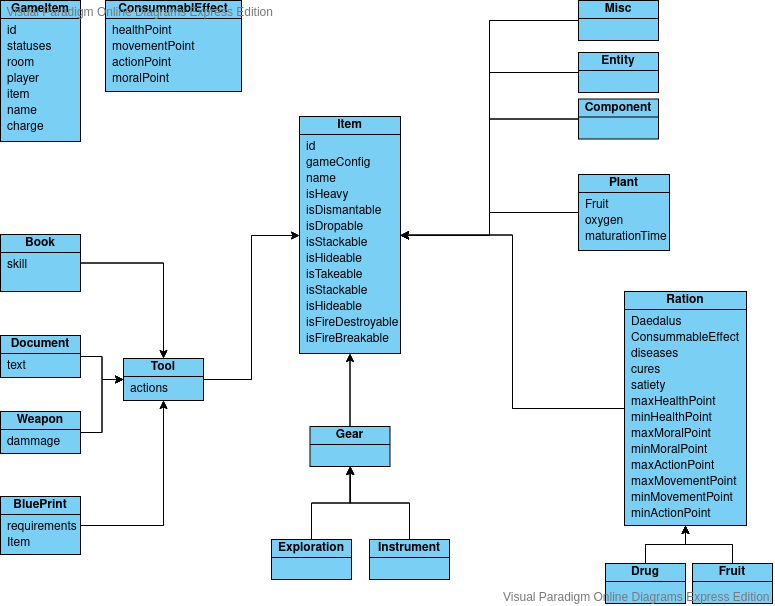

#Equipments

#Data model: 

## GameEquipment
Is the occurence of an equipment in a Daedalus,  this entity will hold the actual equipment informations (statuses, room, etc...)

## EquipmentConfig
Is an abstract class holding all the default information of an Equipment (breakableRate, isAlienArtifact, isFirebreakable etc...)  
The Equipment is unique accross a GameConfig

## ItemConfig and GameItem
Refine the Equipment classes in order to add specificities of the Items (isHideable, isDropable, etc...) 

## EquipmentMechanic
Describe the gameplay mechanisms of each equipment (plant, ration, tool...)

## Ration (parent of Drug and Fruit)

Describe foods item, it holds value describing the maximum and minimum value that it can have
these value for a ration are: minActionPoint: 4, maxActionPoint:4 for example

## Gear (parent of Exploration and Instrument)

These are items with passive effects

## Tools (parent of Weapon, BluePrint, Book, Document)

These are items with specific actions

### Weapon

Is a tool with the action Attack and some dammage, accuracy, etc...

### Book

Is a tool with the Action Learn and a skill to learn

### BluePrint

Is a tool with the action assemble, with some required Items, and the produced Item

## Plant

Is an item with a Fruit and a PlantEffect

#Effects

## ConsumableEffect

Is the effect of a consumable for a given Ration and a Daedalus (ActionPoint, MovementPoint, HealthPoint, MentalPoint)

## PlantEffect

Is the effect of a plant for a given Plant and Daedalus (Oxygen, maturationTime)