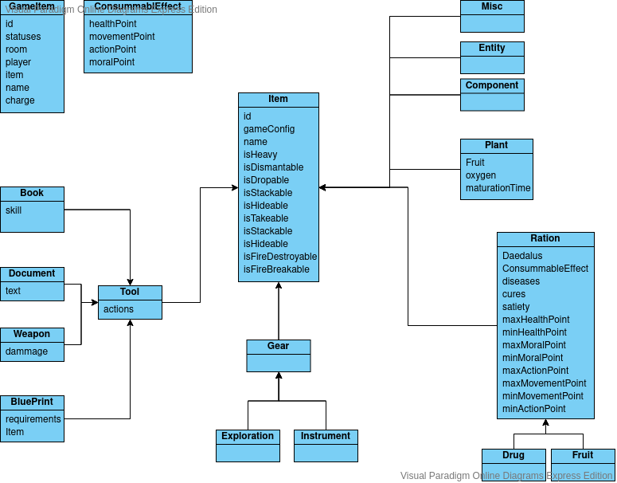

# Equipment
This module handle equipments.
Equipments represent the object the player can interact with in the Daedalus.
They can provide action, modify event output...

Item extend Equipment class, it represents all the equipment that can be moved by player.

Door extends Equipment class, it represents equipment making the junction between 2 places.
Consequently, it is present in 2 different places at once.

# Data model: 

# Directory Tree:
    |-- config
    |-- Criteria
    |-- CycleHandler
    |-- ConfigData/DataFixtures
    |-- DependencyInjection
    |-- Entity
    |-- Enum
    |-- Event
    |-- Listener
    |-- Normalizer
    |-- Repository
    |-- Service

# Entities
## GameEquipment
Is the occurrence of equipment in a Daedalus,  this entity will hold the actual equipment information (statuses, room, etc...)

## EquipmentConfig
Is an abstract class holding all the default information of an Equipment (breakableRate, isAlienArtifact, isFirebreakable etc...)  
The Equipment is unique across a GameConfig

## ItemConfig and GameItem
Refine the Equipment classes in order to add specificities of the Items (isHideable, isDroppable, etc...)

## EquipmentMechanic
Describe the gameplay mechanisms of each equipment (plant, ration, tool...)

# Mechanics

## Ration (parent of Drug and Fruit)

Describe foods item, it holds value describing the maximum and minimum value that it can have
these value for a ration are: minActionPoint: 4, maxActionPoint:4 for example

## Gear (parent of Exploration and Instrument)

These are items with passive effects. They change events cost and output using [modifiers](../Modifier/README.md).

## Tools (parent of Weapon, BluePrint, Book, Document)

Tools provide additional actions to the equipment, however those actions are only available if the equipment is operational (charged and not broken). Each equipment can only have one tool mechanic.

### Weapon

Is a tool with the action Attack and some damage, accuracy, etc...

### Book

Is a tool with the Action Learn and a skill to learn

### BluePrint

Is a tool with the action assemble, with some required Items, and the produced Item

## Plant

Is an item with a Fruit and a PlantEffect

# Effects

## ConsumableEffect

Is the effect of a consumable for a given Ration and a Daedalus (ActionPoint, MovementPoint, HealthPoint, MentalPoint)

## PlantEffect

Is the effect of a plant for a given Plant and Daedalus (Oxygen, maturationTime)
